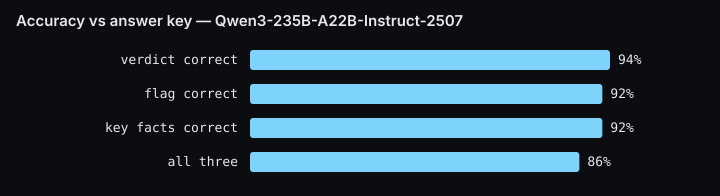
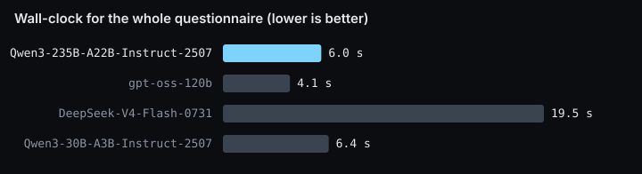
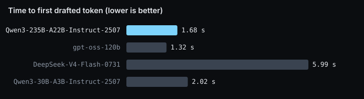
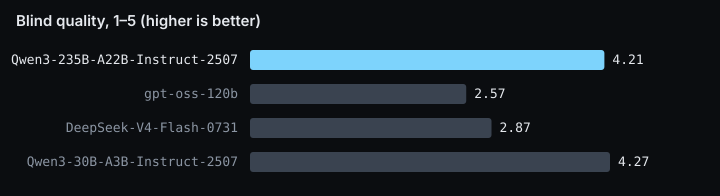
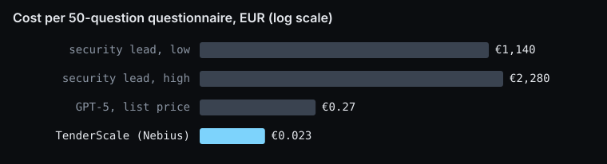

# Attest — results pack

Generated 2026-09-23 09:22 UTC from `data/benchmark.json`, `data/eval.json`, `data/pricing.json`. Regenerate with `npm run report`.

## 1. Accuracy against a held-out answer key (the demo company)

Questionnaire: **CAIQ v4.1 — CSA STAR self-assessment** for **Personivo B.V.** (50 CAIQ v4.1 questions, answered from 3 policies + last year's questionnaire). Answer key never shown to the pipeline. Judge for the facts check: `DeepSeek-V4-Pro-0813` (sees the key).

| Metric | Qwen3-235B-A22B-Instruct-2507 |
|---|---|
| Verdict correct (Yes / No / Unknown) | **94%** |
| Flag correct (ready · review · no evidence) | **92%** |
| Key facts correct | **92%** |
| All three correct | **86%** |
| Answers with an invented fact | **1** / 50 |
| Traps caught (outdated · conflict · uncovered · honest no) | **6 / 8** |
| Wall-clock, 50 questions | **7.9 s** |
| Cost, whole questionnaire | **$0.023** |

### Trap questions

| Trap | Question | Expected | Got | Verdict | Flag | Facts |
|---|---|---|---|---|---|---|
| OUTDATED | BCR-08.1 | yes · needs_approval | yes · no_evidence | ❌ | ❌ | ❌ |
| OUTDATED | BCR-08.3 | yes · needs_approval | yes · needs_approval | ✅ | ✅ | ✅ |
| OUTDATED | BCR-11.1 | yes · needs_approval | yes · none | ✅ | ❌ | ✅ |
| CORRECT ANSWER IS NO | CEK-08.1 | no · none | no · none | ✅ | ✅ | ✅ |
| CONTRADICTION between two policies | DSP-16.1 | yes · needs_approval | partial · needs_approval | ✅ | ✅ | ✅ |
| UNCOVERED | DSP-18.1 | unknown · no_evidence | unknown · no_evidence | ✅ | ✅ | ✅ |
| UNCOVERED | GRC-08.1 | unknown · no_evidence | unknown · no_evidence | ✅ | ✅ | ✅ |
| CONTRADICTION between two policies | IPY-04.1 | yes · needs_approval | partial · needs_approval | ✅ | ✅ | ✅ |

## 2. Model selection matrix (why this drafter)

Identical pipeline, prompts, evidence and parallelism on **Vendor Security Assessment 2026** (50 questions, 2 runs per candidate). Every answer graded blind by `DeepSeek-V4-Pro-0813` (1–5: groundedness, completeness, precision). Prices are live list prices from the providers' model endpoints.

| Model | Where | Wall-clock (median) | First token (median) | Per question | Cost / run | $/1M in · out | Quality | Groundedness | Hallucinated |
|---|---|---|---|---|---|---|---|---|---|
| **Qwen3-235B-A22B-Instruct-2507** (chosen) | Nebius Token Factory | 6.0 s | 1.68 s | 2.6 s | $0.0221 | 0.20 · 0.60 | 4.21 | 3.90 | 11 |
| gpt-oss-120b | Nebius Token Factory | 4.1 s | 1.32 s | 2.3 s | $0.0160 | 0.10 · 0.50 | 2.57 | 3.16 | 1 |
| DeepSeek-V4-Flash-0731 | Nebius Token Factory | 19.5 s | 5.99 s | 12.3 s | $0.0161 | 0.14 · 0.28 | 2.87 | 3.38 | 0 |
| Qwen3-30B-A3B-Instruct-2507 | Nebius Token Factory | 6.4 s | 2.02 s | 3.5 s | $0.0118 | 0.10 · 0.30 | 4.27 | 4.18 | 8 |
| gemma-3-27b-it | nebius | failed (ENOENT: no such file or directory, open ) | | | | | | | |

## 3. Cost of the same run at closed-model list prices

Token volume measured on the chosen open model (89,681 in · 7,374 out per run), priced at public list prices. Latency and quality of closed models are not measured (no closed-model key was available on the day).

| Model | $/1M in · out | Cost per questionnaire | vs Qwen3-235B-A22B-Instruct-2507 |
|---|---|---|---|
| **Qwen3-235B-A22B-Instruct-2507** on Nebius | 0.20 · 0.60 | **$0.0221** | 1× |
| GPT-5 (list) | 1.25 · 10.00 | $0.186 | 8× |
| GPT-4o (list) | 2.50 · 10.00 | $0.298 | 13× |
| Claude Sonnet 4.5 (list) | 3.00 · 15.00 | $0.380 | 17× |

Manual baseline for a questionnaire this size: 20–40 hours of a sales engineer / security lead.

## 4. Engineering facts for the slides

- Live product: https://hackathon-ten-zeta-43.vercel.app · deck: /pitch.html · numbers: /benchmark
- Pipeline: triage (category + risk, plain JSON, 5 questions per call) ∥ retrieval (Qwen3-Embedding-8B, 4096-dim, hot in-memory cosine, < 1 ms, top-6 + best past answer) → drafting (Qwen3-235B-A22B-Instruct, one question per call, 50 streams in parallel, evidence-only, verdict + citations + confidence + flag) → SSE to the workspace. Tavily prospect brief runs on the side.
- Rate limit observed on the Nebius account: 600 requests / 400K tokens per minute, dynamic scaling; a 50-question run uses ~57 requests.
- Warm end-to-end runs during development: 3.7–5.4 s for 50 questions, first token 0.9–1.8 s, ~$0.022 per questionnaire.
- Why not the small model for triage: Qwen3-30B-A3B measured 3.6 s per triage call vs 1.8 s for the 235B on this endpoint; JSON mode added ~2.5 s per call. Measured, then changed.
